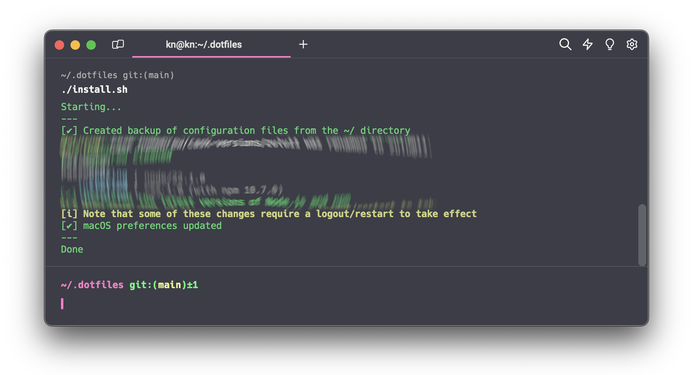

# I love dotfiles!

[](./LICENSE)


## Introduction

I like to automate my work and all everyday duties. That's why I decided to create this repo and dotfiles that allow me
to work less, automate the installation of stuff needed for my work, and backup all my settings here :)

Read [the blog post](https://niziol.me/2024/05/i-love-dotfiles/) for more details.

## Included and supported

- [Oh My Zsh](https://ohmyz.sh)
- [Powerlevel10k](https://github.com/romkatv/powerlevel10k) - theme for Oh My Zsh
- [Homebrew](https://brew.sh)
- [Node.js](https://nodejs.org) and [npm](https://www.npmjs.com)
- [Mackup](https://github.com/lra/mackup)
- [mas](https://github.com/mas-cli/mas)

## Installation

1. Clone the repo into the ~/.dotfiles directory:

    ```bash
    git clone git@github.com:macsmister/dotfiles.git ~/.dotfiles
    ```

   **Attention.**
   It's crucial to clone the repo into the `~/.dotfiles` directory, which is referenced in the dotfiles configuration.


2. Install the dotfiles:

    ```bash
    cd ~/.dotfiles && ./install.sh
    ```

3. Restore applications' settings:

    ```bash
    mackup restore
    ```

   **Attention.**
   You need to make a backup first by running `mackup backup` and sync with your cloud storage.

## Steps of the installation process

1. Installation of `Homebrew`
2. Installation of `Oh My Zsh`
3. Backup of configuration files from the `$HOME` directory
    - `.zshrc`
    - `.p10k.zsh`
    - `.mackup/`
    - `.mackup.cfg`
4. Update of `Homebrew` and all installed formulae
5. Installation of dependencies and applications - [Homebrew Bundle](https://github.com/Homebrew/homebrew-bundle)
6. Installation of applications from Mac App Store - `mas` tool
7. Set the macOS preferences
8. Set shell aliases

## Oh My Zsh preferences

- Uses the [Powerlevel10k](https://github.com/romkatv/powerlevel10k) theme
- Locale-related preferences:
    - `LC_ALL=en_US.UTF-8`
    - `LANG=en_US.UTF-8`
- Enter the SSH key passphrase once and only when needed
- Support [The Fuck](https://github.com/nvbn/thefuck) utility

## Homebrew Bundle

The [Homebrew Bundle](https://github.com/Homebrew/homebrew-bundle) installs all the packages and applications.
Also, from the Mac App Store.

Configuration of the Homebrew Bundle is stored in the [Brewfile](./Brewfile). See below part of the configuration:

```bash
# Taps
tap 'homebrew/cask-fonts'
tap 'homebrew/cask-versions'
# ...

# Binaries
brew 'bash' # Latest Bash version
brew "bat"
# ...

# Apps
cask 'discord'
cask 'docker'
# ...

# Fonts
cask 'font-lato'
cask 'font-open-sans'
# ...

# Mac App Store
mas 'Amphetamine', id: 937984704
mas 'Bitwarden', id: 1352778147
# ...
```

## Mackup

[Mackup](https://github.com/lra/mackup) is a tool for backing up applications' preferences. See
[how it works](https://github.com/lra/mackup?tab=readme-ov-file#bullsht-what-does-it-really-do-to-my-files). I decided
to store backup in iCloud and support all applications except for:

- Iterm2
- Mackup
- Powerlevel10k
- Oh My Zsh

I don't make backups of `Iterm2` preferences because of the following issues:

- [Mackup makes iTerm2 theme disappear](https://github.com/lra/mackup/issues/1916)
- [Initial backup fails with symlink problems on iterm2](https://github.com/lra/mackup/issues/1925)

Other than that, I rarely use Iterm2. I prefer [Warp](https://www.warp.dev/).

`Mackup`, `Powerlevel10k`, and `Oh My Zsh` preferences are stored in the dotfiles repo, so I don't want to duplicate
that.

## Aliases

All aliases are defined in the [aliases.zsh](./aliases.zsh) file. The idea was to not duplicate aliases introduced by
`Oh My Zsh` and create really useful aliases.

See below part of all the aliases:

```bash
#
# Miscellaneous
#
alias o='open'
alias cpr='cp -r'
# ...

#
# Docker
#
alias dce='docker compose exec'
alias dcl='docker compose logs -f'
# ...
```

## macOS preferences

Stored in the [.macos](./.macos) file. Not all preferences are helpful for me, so I enabled only some of them. I decided
to keep all preferences - maybe I will use others too in the future.
Thanks to Mathias Bynens - https://mths.be/macos 💪

See below part of all the preferences:

```bash
# Expand save panel by default
defaults write NSGlobalDomain NSNavPanelExpandedStateForSaveMode -bool true
defaults write NSGlobalDomain NSNavPanelExpandedStateForSaveMode2 -bool true
# ...

# Expand print panel by default
defaults write NSGlobalDomain PMPrintingExpandedStateForPrint -bool false
defaults write NSGlobalDomain PMPrintingExpandedStateForPrint2 -bool false
# ...

# Sleep the display after 4 minutes
sudo pmset -a displaysleep 4
# ...
```

## Inspirations ❤️

- https://github.com/webpro/awesome-dotfiles
- https://dotfiles.github.io
- [Getting started with dotfiles](https://www.webpro.nl/articles/getting-started-with-dotfiles) article
  by [L. Kappert](https://github.com/webpro)
- [Getting started with dotfiles](https://driesvints.com/blog/getting-started-with-dotfiles/) article
  by [D. Vints](https://github.com/driesvints)
